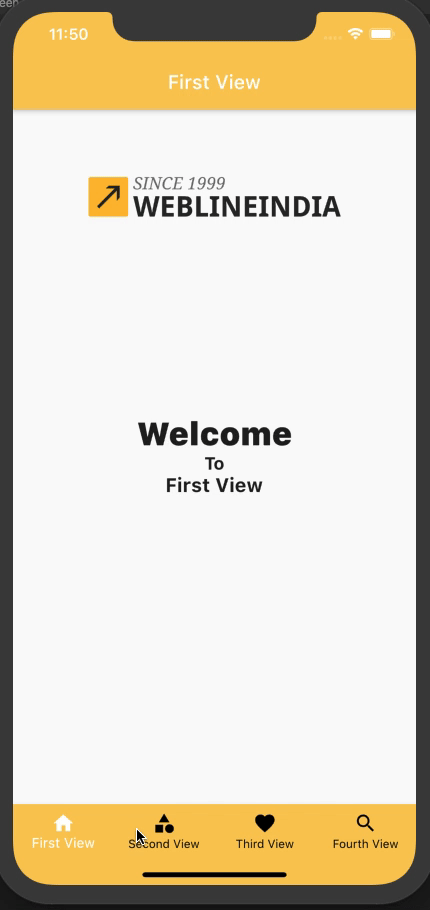

# Flutter - Tab Bar Menu / Bottom Navigation Component

A Flutter based Reusable Bottom Navigation component which provides Bottom Navigation with configurable items that can be used in any Flutter application.

## Table of contents
- [Flutter Support](#Flutter-support)
- [Demo](#demo)
- [Features](#features)
- [Getting started](#getting-started)
- [Usage](#usage)
- [Methods](#methods)
- [Want to Contribute?](#want-to-contribute)
- [Need Help / Support?](#need-help)
- [Collection of Components](#collection-of-Components)
- [Changelog](#changelog)
- [License](#license)
- [Keywords](#Keywords)

## Flutter Support

Version - Flutter 1.17 (stable)

We have tested our program in above version, however you can use it in other versions as well.

## Demo

------

## Features

* Bottom Tab Bar Menu view with minimalistic code and configurable UI option.
* Handled navigation using stateless widget. 

## Getting started

* Download this sample project and import app_bottom_navigation.dart Widget file in your Flutter App. 
* Update Titles based on your requirements. 

## Usage

Setup process is described below to integrate in project.

## Configure Bottom Navigation View in your widget by following below method steps

### Methods

Step 1.Add  'provider' package to pubspec.yaml

Step 2. Add MultiProvider in Your application widget like this
       
    // Put BottomNavigatorProvider as mention below
    class MyApp extends StatelessWidget {
      @override
      Widget build(BuildContext context) {
        final MaterialColor colorCustom = MaterialColor(0xFFFACA58, color);
        return MultiProvider(
          providers: [
            ChangeNotifierProvider.value(
              value: BottomNavigatorProvider(),
            )
          ],
          child: MaterialApp(
            title: 'Flutter Demo',
            home: ...,
          ),
        );
      }
    }
       

Step 3. User following BottomNavigation constructor for adding Bottom Navigation to user main screen             
       
         List<BottomNavigationBarItem> arrBottomItems = [];
         Color color;
         Color selectedColor;
         bool showSelectedLables;
         bool showUnselectedLables;
         Color backgroundColor;

         // ignore: sort_constructors_first
        BottomNavigation({
         this.arrBottomItems,
         this.showSelectedLables,
         this.showUnselectedLables,
         this.backgroundColor,
         this.color,
         this.selectedColor});
        

Step 4. Pass TabItems to BottomNavigation widget. 

    this.arrBottomItems = []] // Pass tabItem in bottom navigation for displaying use 'tabItem' helper method to create tabitems 

    //Use our helper method to create tabItems for Bottom Navigation
    BottomNavigationBarItem tabItem(String title, IconData icon) {
        return BottomNavigationBarItem(
        icon: Icon(icon),
        title: Text(title),
        );
    }

Step 5.if you want set color and selected color of tabs.

    color : Colors.black
    selectedColor: Colors.white
    
Step 6.if you want enable/disable lables of tab items.
    
    showSelectedLables : true  // if you want to show selected lables only otherwise false
    showUnselectedLables : true // if you want to show unselected lables only otherwise false

           }
Step 7. if you want selected index of Bottom Navigation you can get that in following way 

    class HomeScreen extends StatelessWidget {
     ...
     ... 
     
      @override
      Widget build(BuildContext context) {
        final MaterialColor colorCustom = MaterialColor(0xFFFACA58, color);
        return Scaffold(
          appBar: AppBar(
              centerTitle: true,
              iconTheme: const IconThemeData(color: Colors.white),
              /* Use our BottomNavigatorProvider Provider like below for getting  selectedIndex and use it as per your need in below snippet we are       changeing appbar title */
              title: Consumer<BottomNavigatorProvider>(
                builder: (ctx, item, child) {
                  if (item.selectedIndex == 0) {
                    return const Text(
                      'First View',
                      style: TextStyle(color: Colors.white),
                    );
                  } else if (item.selectedIndex == 1) {
                    return const Text('Second View',
                        style: TextStyle(color: Colors.white));
                  } else if (item.selectedIndex == 2) {
                    return const Text('Third View',
                        style: TextStyle(color: Colors.white));
                  } else if (item.selectedIndex == 3) {
                    return const Text('Fourth View',
                        style: TextStyle(color: Colors.white));
                  } else {
                    return null;
                  }
                },
              ),
              brightness: Brightness.dark),
          body: Center(
          
            child: Consumer<BottomNavigatorProvider>(
              builder: (ctx, item, child) {
                switch (item.selectedIndex) {
                  case 0:
                    return FirstView();
                    break;
                  case 1:
                    return SecondView();
                    break;
                  case 2:
                    return ThirdView();
                    break;
                  case 3:
                    return FourthView();
                    break;
                  default:
                    return FirstView();
                    break;
                }
              },
            ),
          ),
          bottomNavigationBar: BottomNavigation(
              arrBottomItems: arrBottomItems,
              backgroundColor: colorCustom,
              showSelectedLables: true,
              showUnselectedLables: true,
              color: Colors.black,
              selectedColor: Colors.white),
        );
      }
    }
    
------

## Want to Contribute?

- Created something awesome, made this code better, added some functionality, or whatever (this is the hardest part).
- [Fork it](http://help.github.com/forking/).
- Create new branch to contribute your changes.
- Commit all your changes to your branch.
- Submit a [pull request](http://help.github.com/pull-requests/).

------

## Need Help? 
If you need help then feel free to contact our [Flutter developers](https://www.weblineindia.com/flutter-cross-platform-mobile-app-development.html).

 ------
 
## Collection of Components
 We have built many other components and free resources for software development in various programming languages. Kindly click here to view our [Free Resources for Software Development.](https://www.weblineindia.com/software-development-resources.html)
 
------

## Changelog
Detailed changes for each release are documented in [CHANGELOG](./CHANGELOG).

## License

[MIT](LICENSE)

[mit]: https://github.com/weblineindia/Flutter-TabBar-Menu/blob/master/LICENSE

## Keywords
Flutter Bottom Navigation Menu, TabBar Menu, Bottom TabBar, Bottom Navigation View, TabBar Navigation, Weblineindia
